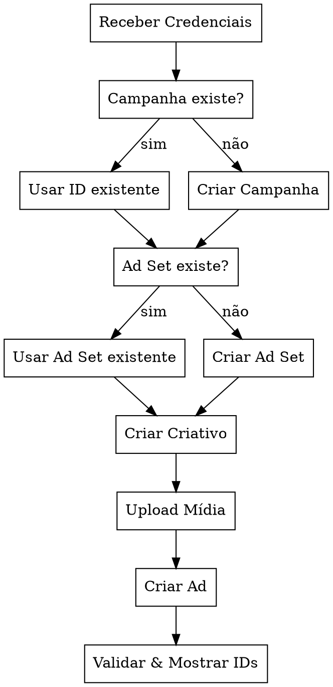

# Ads IA WhatsApp - Automação Meta Ads WhatsApp via Terminal

Skill para criar e gerenciar campanhas de mensagens WhatsApp no Meta/Facebook Ads usando a Marketing API diretamente do terminal via `curl`.

## When to Use

- Criar campanhas, conjuntos de anúncios ou criativos no Meta Ads
- Editar campanhas/ad sets/criativos existentes
- Subir mídia (vídeo/foto) via API
- Duplicar ou ajustar anúncios para clientes
- Qualquer operação com a Meta Marketing API

**When NOT to use:**
- Relatórios/analytics (usar ferramentas de reporting)
- Configuração de pixel ou eventos
- Gerenciamento de Business Manager

## Credenciais Obrigatórias

Sempre solicitar ao usuário no prompt:

| Campo | Formato | Exemplo |
|-------|---------|---------|
| Ad Account ID | `act_XXXXXXXXX` | `act_976695276351659` |
| Access Token | String longa | Fornecido pelo usuário |

**NUNCA armazenar tokens na skill ou em arquivos.** Sempre receber no prompt.

## Fluxo Principal



## Step-by-Step

### 1. Validar Credenciais

Testar acesso antes de qualquer operação:

```bash
curl -s "https://graph.facebook.com/v21.0/act_ACCOUNT_ID?fields=name,account_status&access_token=TOKEN" | jq .
```

**account_status esperado:** `1` (ativo)

### 2. Campanha

**Usar existente:** Apenas verificar se existe e está ativa:
```bash
curl -s "https://graph.facebook.com/v21.0/CAMPAIGN_ID?fields=name,status,objective&access_token=TOKEN" | jq .
```

**Criar nova** (objetivo Mensagens/WhatsApp):
```bash
curl -s -X POST "https://graph.facebook.com/v21.0/act_ACCOUNT_ID/campaigns" \
  -d "name=NOME_DA_CAMPANHA" \
  -d "objective=OUTCOME_ENGAGEMENT" \
  -d "status=PAUSED" \
  -d "special_ad_categories=[]" \
  -d "access_token=TOKEN" | jq .
```

**Objetivos comuns:**
| Objetivo | Valor API |
|----------|-----------|
| Mensagens/WhatsApp | `OUTCOME_ENGAGEMENT` |
| Conversões/Vendas | `OUTCOME_SALES` |
| Tráfego | `OUTCOME_TRAFFIC` |
| Leads | `OUTCOME_LEADS` |

> **Sempre criar com `status=PAUSED`** para revisão antes de ativar.

### 3. Conjunto de Anúncios (Ad Set)

**Usar existente:**
```bash
curl -s "https://graph.facebook.com/v21.0/ADSET_ID?fields=name,status,targeting,daily_budget,bid_amount&access_token=TOKEN" | jq .
```

**Criar novo** (WhatsApp como destino):
```bash
curl -s -X POST "https://graph.facebook.com/v21.0/act_ACCOUNT_ID/adsets" \
  -d "name=NOME_CONJUNTO" \
  -d "campaign_id=CAMPAIGN_ID" \
  -d "daily_budget=VALOR_EM_CENTAVOS" \
  -d "billing_event=IMPRESSIONS" \
  -d "optimization_goal=CONVERSATIONS" \
  -d "destination_type=WHATSAPP" \
  -d "status=PAUSED" \
  -d "targeting={\"geo_locations\":{\"countries\":[\"BR\"]},\"age_min\":18,\"age_max\":65}" \
  -d "start_time=YYYY-MM-DDTHH:MM:SS-0300" \
  -d "access_token=TOKEN" | jq .
```

**Campos de targeting importantes:**
- `geo_locations`: países, estados, cidades, raio
- `age_min` / `age_max`: faixa etária
- `genders`: `[1]` = masculino, `[2]` = feminino, `[0]` = todos
- `interests`: array de interesses com `id` e `name`
- `custom_audiences`: públicos personalizados

### 4. Upload de Mídia

**Upload de vídeo:**
```bash
# Primeiro baixar o arquivo (se vier de link externo)
curl -L -o video.mp4 "URL_DO_VIDEO"

# Upload para Meta
curl -s -X POST "https://graph.facebook.com/v21.0/act_ACCOUNT_ID/advideos" \
  -F "source=@video.mp4" \
  -F "title=TITULO_VIDEO" \
  -F "access_token=TOKEN" | jq .
```

**Upload de imagem:**
```bash
curl -L -o image.jpg "URL_DA_IMAGEM"

curl -s -X POST "https://graph.facebook.com/v21.0/act_ACCOUNT_ID/adimages" \
  -F "filename=@image.jpg" \
  -F "access_token=TOKEN" | jq .
```

**Google Drive:** Para baixar de links do Google Drive, extrair o FILE_ID e usar:
```bash
# Extrair ID do link: https://drive.google.com/file/d/FILE_ID/view
curl -L -o media_file "https://drive.google.com/uc?export=download&id=FILE_ID"
```

> Guardar o `video_id` ou `hash` da imagem retornados para usar no criativo.

### 5. Criar Criativo (Ad Creative)

**Com vídeo:**
```bash
curl -s -X POST "https://graph.facebook.com/v21.0/act_ACCOUNT_ID/adcreatives" \
  -d "name=NOME_CRIATIVO" \
  -d 'object_story_spec={"page_id":"PAGE_ID","video_data":{"video_id":"VIDEO_ID","message":"TEXTO_PRINCIPAL","title":"TITULO","call_to_action":{"type":"WHATSAPP_MESSAGE","value":{"link":"https://api.whatsapp.com/send?phone=NUMERO"}}}}' \
  -d "access_token=TOKEN" | jq .
```

**Com imagem:**
```bash
curl -s -X POST "https://graph.facebook.com/v21.0/act_ACCOUNT_ID/adcreatives" \
  -d "name=NOME_CRIATIVO" \
  -d 'object_story_spec={"page_id":"PAGE_ID","link_data":{"image_hash":"IMAGE_HASH","message":"TEXTO_PRINCIPAL","name":"TITULO","call_to_action":{"type":"WHATSAPP_MESSAGE","value":{"link":"https://api.whatsapp.com/send?phone=NUMERO"}}}}' \
  -d "access_token=TOKEN" | jq .
```

**CTAs comuns:**
| CTA | Valor API |
|-----|-----------|
| Enviar mensagem WhatsApp | `WHATSAPP_MESSAGE` |
| Saiba mais | `LEARN_MORE` |
| Comprar agora | `SHOP_NOW` |
| Cadastre-se | `SIGN_UP` |

### 6. Criar Anúncio (Ad)

```bash
curl -s -X POST "https://graph.facebook.com/v21.0/act_ACCOUNT_ID/ads" \
  -d "name=NOME_ANUNCIO" \
  -d "adset_id=ADSET_ID" \
  -d "creative={\"creative_id\":\"CREATIVE_ID\"}" \
  -d "status=PAUSED" \
  -d "access_token=TOKEN" | jq .
```

### 7. Validação Final

Após criar tudo, listar os anúncios do ad set para confirmar:

```bash
curl -s "https://graph.facebook.com/v21.0/ADSET_ID/ads?fields=name,status,creative{name,object_story_spec}&access_token=TOKEN" | jq .
```

## Instruções de Execução

1. **Executar cada etapa em ordem** — usar o ID gerado em cada etapa para a próxima
2. **Mostrar os IDs criados** ao final de cada etapa
3. **Se der erro**, mostrar o erro completo e diagnosticar antes de continuar
4. **Sempre criar com status PAUSED** — nunca ativar automaticamente
5. **Confirmar com o usuário** antes de ativar qualquer campanha/ad set/ad

## Tratamento de Erros Comuns

| Erro | Causa | Solução |
|------|-------|---------|
| `(#100) Invalid parameter` | Campo obrigatório faltando ou formato errado | Verificar campos e formatos na documentação |
| `(#2635) Invalid connection` | Página não vinculada à conta | Verificar vinculação da Page ao Ad Account |
| `(#1487) Budget too low` | Budget abaixo do mínimo | Aumentar `daily_budget` (mínimo ~R$6/dia = 600 centavos) |
| `(#100) Unsupported post request` | Token sem permissão | Verificar permissões: `ads_management`, `ads_read` |
| `OAuthException` | Token expirado ou inválido | Solicitar novo token ao usuário |

## Consultas Úteis

**Listar campanhas da conta:**
```bash
curl -s "https://graph.facebook.com/v21.0/act_ACCOUNT_ID/campaigns?fields=name,status,objective&limit=50&access_token=TOKEN" | jq .
```

**Listar ad sets de uma campanha:**
```bash
curl -s "https://graph.facebook.com/v21.0/CAMPAIGN_ID/adsets?fields=name,status,daily_budget,targeting&access_token=TOKEN" | jq .
```

**Listar criativos da conta:**
```bash
curl -s "https://graph.facebook.com/v21.0/act_ACCOUNT_ID/adcreatives?fields=name,object_story_spec&limit=20&access_token=TOKEN" | jq .
```

**Buscar Page ID vinculada:**
```bash
curl -s "https://graph.facebook.com/v21.0/act_ACCOUNT_ID/promote_pages?fields=name,id&access_token=TOKEN" | jq .
```

## Checklist de Validação

- [ ] Credenciais testadas e válidas
- [ ] Campanha criada/identificada com ID correto
- [ ] Ad Set(s) criado(s)/identificado(s) com targeting correto
- [ ] Mídia(s) uploaded com sucesso (video_id ou image_hash obtidos)
- [ ] Criativo(s) criado(s) com texto, título e CTA corretos
- [ ] Anúncio(s) criado(s) e vinculado(s) ao ad set
- [ ] Todos os elementos com status PAUSED
- [ ] IDs finais apresentados ao usuário
